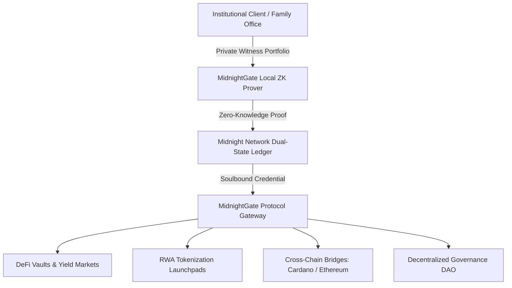

# 🏛️ MidnightGate — Enterprise Architecture & Scaling Roadmap

> **Level 7 (Master Track / Founder Belt) Strategic Architecture Document**  
> Focus: Institutional Compliance Bridges, Multi-Chain Soulbound Attestations, and Decentralized Governance.

---

## 🧭 Enterprise Vision & High-Level Architecture

MidnightGate aims to be the foundational zero-knowledge compliance infrastructure for regulated Web3 finance. By bridging institutional privacy standards (GDPR, SOC2, SEC Rule 506(c)) with decentralized protocols, MidnightGate enables billions in institutional capital to flow into on-chain markets safely.

---

## 🗺️ Multi-Phase Enterprise Milestones

### Phase 1: Core Midnight Preprod & Zero-Knowledge Engine (Completed ✅)
* Midnight Compact smart contract written with dual-state privacy architecture.
* Local proof server integration and WebAssembly browser-side prover.
* Interactive UI with Lace wallet connector and 1-Click Instant Demo keypairs.
* 4/4 passing automated Vitest simulation test cases with continuous integration.

### Phase 2: Institutional KYC / AML Oracle Bridge (Q2 2026)
* Integration with enterprise identity providers (Chainlink DECO, Fractal ID, Trulioo).
* Encrypted cryptographic oracle signatures feeding the local private witness.
* Zero-knowledge attestation that the user is not on any OFAC sanctions lists without revealing identity.

### Phase 3: Cross-Chain Soulbound Attestations (Q3 2026)
* Cross-chain state relay to **Cardano** (via Midnight-Cardano sidechain bridge) and **Ethereum / Arbitrum** (via ZK light clients).
* Universal Accredited Investor soulbound tokens allowing one-time proof to unlock liquidity across 5+ blockchains.

### Phase 4: Decentralized Governance & Custom Enterprise Gates (Q4 2026)
* MidnightGate DAO: Token-gated governance for adjusting base tier parameters, registering certified oracles, and subsidizing relayer fees.
* White-label GateBuilder API for hedge funds, venture syndicates, and real estate tokenizers.

---

## 🔒 Enterprise Compliance Standards Matrix

| Standard | Description | MidnightGate Architectural Compliance |
| :--- | :--- | :--- |
| **US SEC Rule 506(c)** | Accredited Investor verification for private placements | Satisfies net worth threshold verification ($100k+, $1M+) without storing financial records. |
| **EU GDPR Article 25** | Data Protection by Design and by Default | 100% of PII and asset balances remain in local client memory; zero user data stored on servers. |
| **OFAC Sanctions Filtering** | Verification of clean non-sanctioned wallet origin | Implemented via zero-knowledge merkle tree non-membership proofs. |
| **SOC 2 Type II** | Zero-trust cryptographic security architecture | Fully client-side cryptographic proving prevents server-side honeypots. |
