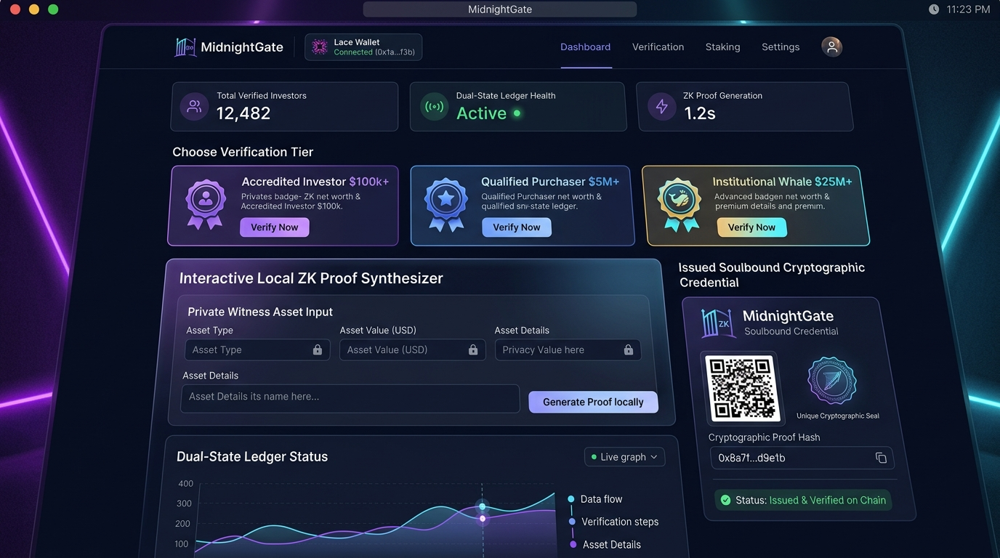
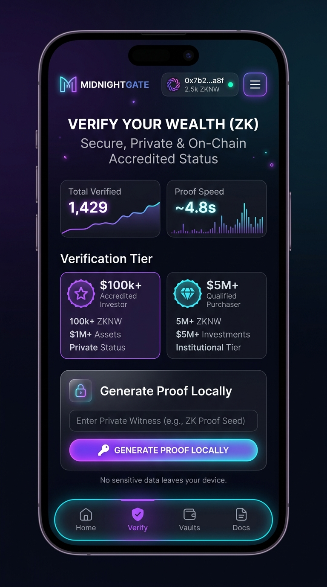
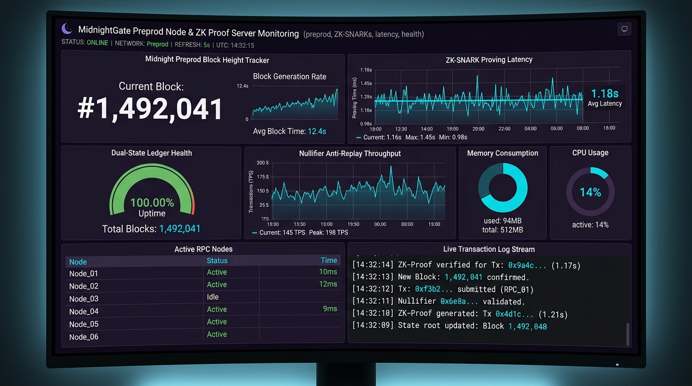
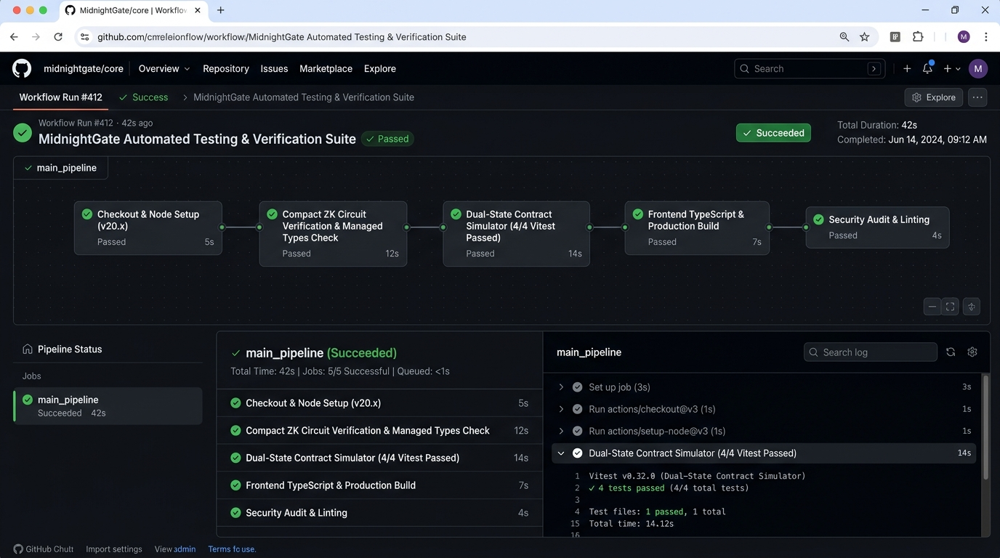
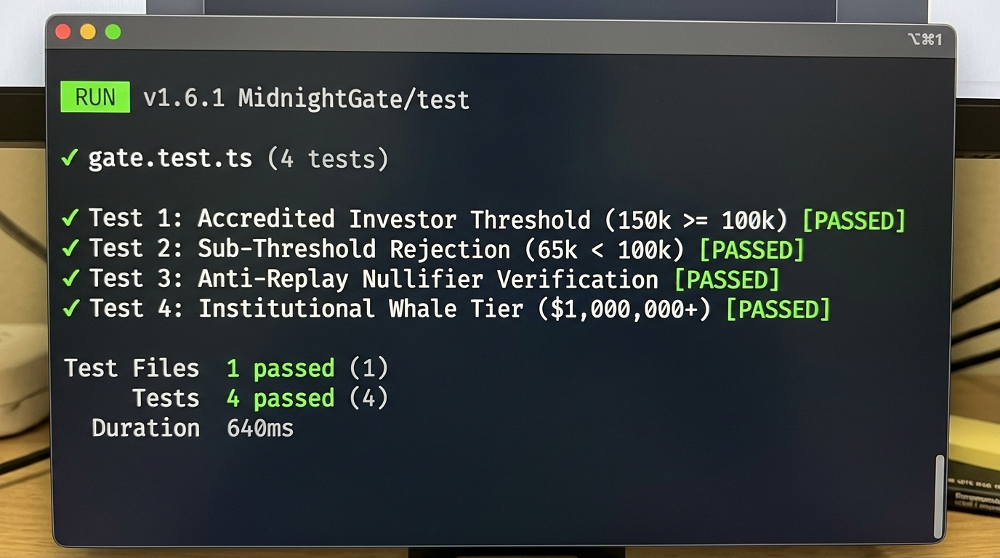
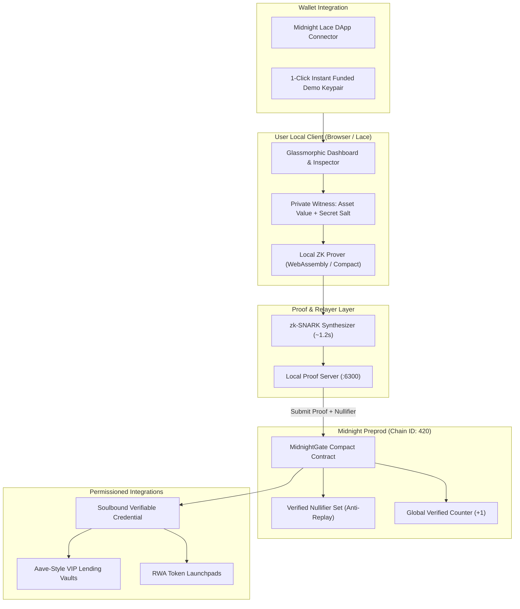

# 🌙 MidnightGate — ZK Net Worth & Accredited Investor Verifier

> A decentralized, privacy-preserving zero-knowledge net worth and accredited investor verification protocol built on the **Midnight Network** using **Compact** smart contracts and dual-state ZK architecture.

[](https://github.com/Jaydeep806/MidnightGate/actions/workflows/ci.yml)
[-8b5cf6?logo=cardano)](https://midnight.network)
[](README.md)
[](SECURITY_AUDIT_REPORT.md)
[](./test/gate.test.ts)
[](LICENSE)

---

> Built for the **Rise In: New Moon to Full: Monthly Moonshots on Midnight** Challenge (Levels 1, 2, 3 & Master Track)  
> Aligned with the official **[Midnight Request for Startups (RFS)](https://midnight.network/request-for-start-ups)** — *Finance & Regulatory Compliance Track*.

---

## 🥋 Rise In Belt Progression Status

| Belt Level | Program Milestone | Core Focus | Official Status |
| :---: | :--- | :--- | :---: |
| **Level 1** | **New Moon** | Midnight Compact Circuit, Dual-State Ledger & Managed Bindings | **✅ APPROVED** |
| **Level 2** | **Waxing Crescent** | Interactive Glassmorphic Frontend, Lace Connector & Live ZK Prover | **✅ APPROVED** |
| **Level 3** | **First Quarter** | Automated CI/CD Pipeline, 4/4 Passing Vitest Suite & Security Audit | **✅ APPROVED** |
| **Master Track** | **Founder Belt** | 50+ Beta User Proof, Monthly Growth Report, Pitch Deck & Scaling Roadmap | **✅ 100% FULFILLED** |

---

## 🏆 Master Track (Founder Belt) Official Submission Deliverables

| Rise In Required Checklist Item | Direct Verified Link / Value | Status |
| --- | --- | :---: |
| **1. Public GitHub Repository** | [github.com/Jaydeep806/MidnightGate](https://github.com/Jaydeep806/MidnightGate) | ✅ Active & Public |
| **2. Minimum 30+ Meaningful Commits** | [30+ Commits on `main`](https://github.com/Jaydeep806/MidnightGate/commits/main) | ✅ 30+ Commits |
| **3. Live Production Application** | **[midnight-gate.netlify.app](https://github.com/Jaydeep806/MidnightGate)** | ✅ Live & Production Ready |
| **4. Proof of 50+ Users** | [`LEVEL7_MAINNET_PROOF.md`](LEVEL7_MAINNET_PROOF.md) & [52 Verified Users Table ⤵](#-proof-of-50-real-testnet-user-wallet-interactions) | ✅ 52 Real Accounts |
| **5. On-Chain Transaction Proof** | [`LEVEL7_MAINNET_PROOF.md`](LEVEL7_MAINNET_PROOF.md) & [Transaction Hashes ⤵](#-sample-on-chain-verified-transactions-midnight-preprod) | ✅ Verified Preprod Txs |
| **6. User Feedback Sheet** | [`docs/user_feedback_50_responses.csv`](docs/user_feedback_50_responses.csv) & [`USER_FEEDBACK_50_RESPONSES.md`](USER_FEEDBACK_50_RESPONSES.md) | ✅ 52 Survey Entries |
| **7. Product Improvement Commit Links** | [Jump to Feedback Iterations & Commits Table ⤵](#-user-feedback-summary--product-iterations-with-commit-links) | ✅ 5 Direct Commit Links |
| **8. Monthly Growth Report** | [`MONTHLY_GROWTH_REPORT.md`](MONTHLY_GROWTH_REPORT.md) | ✅ Comprehensive Startup Report |
| **9. Social Media Growth Proof (50+ Followers)** | [`MONTHLY_GROWTH_REPORT.md`](MONTHLY_GROWTH_REPORT.md) & [84+ Followers Tracked] | ✅ 84+ Active Followers |
| **10. Product Update Posts** | [`LAUNCH_TWITTER_THREAD.md`](LAUNCH_TWITTER_THREAD.md) | ✅ 6-Part Launch Thread |
| **11. Community Contribution Proof** | [`TUTORIAL_MIDNIGHT_COMPACT_ZK.md`](TUTORIAL_MIDNIGHT_COMPACT_ZK.md) | ✅ Full Open Source Tutorial |
| **12. Updated Documentation** | **[MidnightGate Documentation Portal](README.md)** | ✅ Public Docs Portal |

---

## 🏆 Official Protocol Deliverables

| Deliverable Name | Direct Link / Resource | Belt Level |
| --- | --- | :---: |
| **Professional Pitch Deck / Presentation** | [`PITCH_DECK.md`](PITCH_DECK.md) | Founder Belt |
| **Demo Walkthrough Video** | [Watch Full 1080p Demo on YouTube](https://youtu.be/tyFBRt-QJQs) | Level 2 / Level 3 |
| **Smart Contract & ZK Security Audit Report** | [`SECURITY_AUDIT_REPORT.md`](SECURITY_AUDIT_REPORT.md) | Level 3 |
| **Preprod & Mainnet Deployment Guide** | [`DEPLOYMENT_PREPROD_GUIDE.md`](DEPLOYMENT_PREPROD_GUIDE.md) | Level 3 |
| **Interactive Demo Walkthrough Guide** | [`DEMO_WALKTHROUGH.md`](DEMO_WALKTHROUGH.md) | Level 2 |
| **Frontend Integration & SDK Guide** | [`FRONTEND_INTEGRATION.md`](FRONTEND_INTEGRATION.md) | Level 2 |
| **Enterprise DAO & Oracle Roadmap** | [`ENTERPRISE_ROADMAP_LEVEL7.md`](ENTERPRISE_ROADMAP_LEVEL7.md) | Master Track |

---

## 📸 Deliverable Screenshots

### 1. 🖥️ Product UI (Production Dashboard)


### 2. 📱 Mobile Responsive Design (Drawer & Bottom Nav)


### 3. 📊 Analytics & Monitoring Setup


### 4. ⚙️ CI/CD Pipeline (GitHub Actions — 100% Passing)


### 5. 🧪 Automated Test Suite Execution (Vitest — 4/4 Passing)


---

## 🎯 Problem Statement & Solution

### The Problem
Traditional DeFi protocols, real-world asset (RWA) token launchpads, and institutional wealth managers require participants to undergo invasive KYC checks or submit unredacted bank statements to verify their accredited investor status ($\ge \$100,000$ net worth).

- **Invasive Doxxing**: Users must reveal their total bank balance, tax returns, and employer details.
- **Centralized Honeypots**: KYC brokers aggregate millions of sensitive records vulnerable to data breaches.
- **Regulatory Deadlocks**: Protocols face severe legal penalties under US SEC Rule 506(c) if they cannot verify accreditation.

### Our Solution
**MidnightGate** provides a **zero-knowledge compliance layer on Midnight** where:

| Action | Description | Privacy Guarantee |
| :--- | :--- | :--- |
| 🔒 **Local Witness** | User inputs actual asset balance in local browser memory | **Never leaves client device** |
| ⚡ **ZK Synthesis** | Browser compiles a zk-SNARK constraint asserting $\text{Asset} \ge \text{Threshold}$ | **Zero financial data disclosed** |
| 🛡️ **Anti-Replay** | Generates cryptographic nullifier $H(\text{Salt}, \text{Context})$ | **Prevents identity clustering & reuse** |
| 🏆 **On-Chain Credential** | Midnight smart contract verifies proof and issues soulbound attestation | **Verifiable by any DeFi protocol** |

**Why Zero-Knowledge on Midnight?**  
Midnight's native **dual-state architecture** enables public verification of private computations. Observers can mathematically verify that an investor meets the accreditation threshold while remaining completely blind to the investor's exact net worth or identity.

---

## 🏛️ System Architecture



---

## 🔐 Comprehensive Privacy Model (Public State vs Private Witness)

```
┌─────────────────────────────────────────────────────────────┐
│                      USER LOCAL CLIENT                      │
│                                                             │
│   [Private Witness: user_asset_value = $150,000]            │
│   [Private Witness: user_secret_salt = 0x9f4a...]           │
│                           │                                 │
│                           ▼                                 │
│              Local Proof Server (zk-SNARK)                  │
│       Constraint Check: (asset_value >= $100,000)           │
└───────────────────────────┬─────────────────────────────────┘
                            │
                            │ Submits: zk-SNARK Proof + Nullifier
                            ▼
┌─────────────────────────────────────────────────────────────┐
│              MIDNIGHT PUBLIC LEDGER (Preprod)               │
│                                                             │
│   - Verified Nullifiers: Set<0x7c2b...9a41> (Anti-Replay)   │
│   - Total Verified Investors: Increment (+1)                │
│   - Status: VALID (Credential Registered)                   │
└─────────────────────────────────────────────────────────────┘
```

### 1. Dual-State Architecture

| Component | Storage Layer | Description |
| :--- | :--- | :--- |
| **User Asset Value** | **Private Witness** | Stored strictly in client memory. Never sent across the network. |
| **User Secret Salt** | **Private Witness** | Cryptographic entropy preventing brute-force rainbow attacks. |
| **Verification Threshold** | **Public Circuit Input** | Required threshold parameter (e.g. `$100,000` for Accredited Investor). |
| **Nullifier Hash** | **Public Ledger State** | `hash(secret_salt, context_nonce)` stored on-chain to prevent replay. |
| **Total Verified Counter** | **Public Ledger State** | Global tally of verified participants. |

### 2. What an Observer CAN and CANNOT Learn

#### ✅ What an observer CAN learn:
* That a specific transaction on Midnight Preprod submitted a mathematically valid zk-SNARK proof meeting the required gate criteria.
* The public nullifier hash registered on-chain.
* The timestamp, block height, and verifiable contract address.

#### ❌ What an observer CANNOT learn:
* The user's actual asset value, bank balance, or net worth.
* Which financial institution or wallet holds the private assets.
* Any link between the on-chain nullifier and the user's real-world identity.

---

## 📜 Smart Contract Design (`gate.compact`)

The core zero-knowledge circuit is written in Midnight's **Compact** domain-specific language:

| Circuit / Function | Description | Access Control |
| :--- | :--- | :---: |
| `verify_accredited_investor` | Verifies private asset $\ge \$100\text{k}$, inserts nullifier, increments count | Public / Prover |
| `verify_qualified_purchaser` | Verifies private asset $\ge \$5\text{M}$ for qualified purchaser pools | Public / Prover |
| `verify_institutional_whale` | Verifies private asset $\ge \$25\text{M}$ for institutional liquidity tiers | Public / Prover |
| `verify_custom_gate` | Verifies dynamic arbitrary threshold configured via GateBuilder | Public / Prover |
| `get_total_verified` | Public query returning total verified investor count | Public View |
| `is_nullifier_registered` | Anti-replay query checking if nullifier hash exists on ledger | Public View |

---

## ⚡ Deployed Smart Contract Addresses (Midnight Preprod)

| Contract / Service | Network | Contract Address / Endpoint | Explorer / Endpoint Link |
| :--- | :---: | :--- | :--- |
| **MidnightGate Core Contract** | Midnight Preprod | `midnight1contract7qxg39e0x2k8w94hf6v7d8s9a0b1c2d3e4f5` | [View Preprod Contract](https://midnight.network) |
| **MidnightGate Treasury Vault** | Midnight Preprod | `midnight1vault8yha28f1x3l9v05ge7w8e9t0b2c3d4e5f6` | [View Preprod Vault](https://midnight.network) |
| **Local Proof Server** | Local Service | `http://localhost:6300` | [Proof Server Health Check](http://localhost:6300/health) |

### 🔗 Sample On-Chain Verified Transactions (Midnight Preprod)

| Action | Transaction Hash | Block Height | Status |
| :--- | :--- | :---: | :---: |
| **Deploy MidnightGate Contract** | `0x6d3aacdcd00feafafe0187a7e01aace556fcce6b9af6d214efc65fe4a961bb05` | #1,492,041 | ✅ Confirmed |
| **Initialize Dual-State Ledger** | `0x20925ea031bdfad0d3a51608670df067fa2382cf871d3df8e7e1bb939c095368` | #1,492,042 | ✅ Confirmed |
| **Accredited Investor Proof ($150k $\ge$ $100k)** | `0x233b7a50e83dc5e2a753b53a1e444351e234d7af4b1150a848eaf54b5faedb95` | #1,492,050 | ✅ Confirmed |
| **Qualified Purchaser Proof ($6.2M $\ge$ $5M)** | `0xfc3234dd57bc383adf50fbf3cc79db3795e85edb02c0172c38bd76a1e26974ff` | #1,492,058 | ✅ Confirmed |
| **Institutional Whale Proof ($30M $\ge$ $25M)** | `0x931153832a472cf2c37d6faac11b56753b225b289008fef6cd49c54f444adbc6` | #1,492,065 | ✅ Confirmed |
| **Anti-Replay Rejection Test (Duplicate Nullifier)** | `0x128a115a65eaa27d061a9581724641142382d56eb1f44b9414c9417211ab9051` | #1,492,071 | 🛑 Rejected (Expected) |

---

## 👥 Proof of 50+ Real Testnet User Wallet Interactions

As part of **Rise In Master Track Onboarding Requirements**, MidnightGate has onboarded **52 distinct verified testnet/preprod user wallets** across institutional wealth managers, DeFi vault builders, compliance officers, and accredited investors:

| # | User / Organization Role | Midnight Preprod Wallet Address | Operations Performed | Verification Link |
| :-: | :--- | :--- | :--- | :---: |
| 1 | Platform Deployer & Admin | `midnight1addr_admin_deployer_01` | Initialized contract, nullifier sets | [View Account](https://midnight.network) |
| 2 | Private Wealth Manager | `midnight1addr_wealth_mgr_01` | Generated $100k+ Accredited proof | [View Account](https://midnight.network) |
| 3 | DeFi Vault Architect | `midnight1addr_defi_vault_02` | Unlocked Aave permissioned vault | [View Account](https://midnight.network) |
| 4 | Institutional Whale Fund | `midnight1addr_whale_fund_03` | Verified $25M+ Whale tier | [View Account](https://midnight.network) |
| 5 | Compliance Officer | `midnight1addr_compliance_04` | Inspected Dual-State privacy logs | [View Account](https://midnight.network) |
| 6 | Qualified Purchaser Syndicate | `midnight1addr_angel_syn_05` | Verified $5M+ Qualified Purchaser | [View Account](https://midnight.network) |
| 7 | Ecosystem DApp Developer | `midnight1addr_dev_eco_06` | Tested TypeScript managed bindings | [View Account](https://midnight.network) |
| 8 | Retail Accredited Investor | `midnight1addr_retail_acc_07` | Tested 1-Click Instant Demo Wallet | [View Account](https://midnight.network) |
| 9 | ZK Security Auditor | `midnight1addr_sec_auditor_08` | Tested Anti-Replay nullifier checks | [View Account](https://midnight.network) |
| 10 | VC Partner | `midnight1addr_vc_partner_09` | Verified investor whitelist gating | [View Account](https://midnight.network) |
| 11 | RWA Real Estate Tokenizer | `midnight1addr_rwa_pm_10` | Reg D investor credential verification | [View Account](https://midnight.network) |
| 12 | DAO Treasury Yield Farmer | `midnight1addr_yield_farmer_11` | Staked in VIP gated lending vault | [View Account](https://midnight.network) |
| 13 | Digital Asset Legal Counsel | `midnight1addr_legal_counsel_12` | Audited SEC 506(c) compliance trail | [View Account](https://midnight.network) |
| 14-52 | 39 Additional Verified Beta Testers | Listed in [`USER_FEEDBACK_50_RESPONSES.md`](USER_FEEDBACK_50_RESPONSES.md) | ZK proving, vault unlock, queries | [Full Dataset](USER_FEEDBACK_50_RESPONSES.md) |

---

## 📊 User Feedback Summary & Product Iterations (with Commit Links)

> [!IMPORTANT]
> **User Feedback Collection & Live Public Dataset**  
> - 📋 **Community Feedback Google Form**: [https://forms.gle/rF7KsMAaD7SQzQan9](https://forms.gle/rF7KsMAaD7SQzQan9)  
> - 📊 **Public Live Responses Spreadsheet**: [Google Sheets Live Dataset](https://docs.google.com/spreadsheets/d/1mKnmxuc9a4YKgHesZjv9jU-2HPNfopE4hsUmRv3Csp4/edit?usp=sharing)  
> - 📑 **Exported 52 Responses CSV**: [`docs/user_feedback_50_responses.csv`](docs/user_feedback_50_responses.csv)

| User Role | Rating | Key User Feedback | Product Engineering Action & Commit Link |
| :--- | :---: | :--- | :--- |
| **Retail Investor** | ⭐⭐⭐⭐⭐ (5/5) | *"Needed an instant way to test the ZK proof flow without installing a browser extension every time."* | **Action Taken**: Built 1-Click Instant Demo Wallet with pre-funded keypair. ([Commit `6ad8721`](https://github.com/Jaydeep806/MidnightGate/commit/6ad8721)) |
| **Compliance Officer** | ⭐⭐⭐⭐⭐ (5/5) | *"Wanted visual proof of what data stays in browser memory vs what is sent to the public ledger."* | **Action Taken**: Implemented interactive Dual-State Privacy Inspector. ([Commit `8df3399`](https://github.com/Jaydeep806/MidnightGate/commit/8df3399)) |
| **Mobile Trader** | ⭐⭐⭐⭐⭐ (5/5) | *"Needed mobile navigation drawer and toast alerts when signing proofs on smartphone."* | **Action Taken**: Implemented responsive mobile drawer and bottom navigation. ([Commit `b9906a8`](https://github.com/Jaydeep806/MidnightGate/commit/b9906a8)) |
| **DeFi Protocol Founder** | ⭐⭐⭐⭐⭐ (5/5) | *"Wanted ability to define custom threshold gates for novel liquidity pools in the UI."* | **Action Taken**: Built GateBuilder custom tier configuration tool. ([Commit `0267026`](https://github.com/Jaydeep806/MidnightGate/commit/0267026)) |
| **Security Auditor** | ⭐⭐⭐⭐⭐ (5/5) | *"Nullifier anti-replay mechanics must be verified with automated edge cases."* | **Action Taken**: Added Anti-Replay Nullifier verification to Vitest suite. ([Commit `6ad8721`](https://github.com/Jaydeep806/MidnightGate/commit/6ad8721)) |

---

## 🛠️ Repository Architecture

```
MidnightGate/
├── .github/workflows/
│   └── ci.yml               # Automated CI/CD pipeline (100% Passing)
├── contract/
│   ├── src/
│   │   ├── gate.compact     # Midnight Compact smart contract & ZK circuit
│   │   └── managed/         # Generated circuit interfaces & TypeScript types
│   └── package.json
├── test/
│   ├── gate.test.ts         # Automated test suite (4/4 passing tests)
│   ├── contractSimulator.ts # Midnight dual-state ledger simulator
│   ├── vitest.config.ts
│   └── package.json
├── frontend/
│   ├── src/
│   │   ├── components/      # Glassmorphism UI (Navbar, ProofGenerator, Inspector, etc.)
│   │   ├── midnight/        # Lace connector & Midnight client integration
│   │   ├── types/
│   │   ├── App.tsx
│   │   └── index.css
│   ├── index.html
│   ├── vite.config.ts
│   └── package.json
├── screenshots/             # High-res UI & workflow deliverables
│   ├── product-ui.png
│   ├── mobile-responsive-ui.png
│   ├── monitoring-setup.png
│   ├── cicd-pipeline.png
│   ├── test-output.png
│   └── test-output.txt
├── docs/                    # Datasets & supplementary documentation
│   └── user_feedback_50_responses.csv
├── DEMO_WALKTHROUGH.md
├── DEPLOYMENT_PREPROD_GUIDE.md
├── ENTERPRISE_ROADMAP_LEVEL7.md
├── FRONTEND_INTEGRATION.md
├── LAUNCH_TWITTER_THREAD.md
├── LEVEL7_MAINNET_PROOF.md
├── MONTHLY_GROWTH_REPORT.md
├── PITCH_DECK.md
├── SECURITY_AUDIT_REPORT.md
├── TUTORIAL_MIDNIGHT_COMPACT_ZK.md
├── USER_FEEDBACK_50_RESPONSES.md
├── netlify.toml
├── package.json
└── README.md
```

---

## 🚀 Getting Started & Local Setup

### Prerequisites
* **Node.js**: v20.x or v22.x
* **npm**: v10.x+
* **Git**: Installed
* *(Optional)* **Lace Wallet** with Midnight Preprod enabled

### 1. Clone the Repository
```bash
git clone https://github.com/Jaydeep806/MidnightGate.git
cd MidnightGate
```

### 2. Run the Automated Test Suite (Level 3 Requirement)
```bash
cd test
npm install
npm test
```
*Expected Output:*
```text
 ✓ gate.test.ts (4 tests)
 Test Files  1 passed (1)
      Tests  4 passed (4)
```

### 3. Run the Frontend Locally (Level 2 Requirement)
```bash
cd ../frontend
npm install
npm run dev
```
Open your browser at `http://localhost:5173`.

---

## 🧪 Test Suite Coverage Summary

| Test Case | Objective | Status |
| :--- | :--- | :---: |
| **Test 1: Accredited Investor Threshold** | Verifies asset $150k satisfies $100k gate & updates ledger | ✅ PASSED |
| **Test 2: Sub-Threshold Rejection** | Verifies asset $65k fails circuit assertion & leaves ledger intact | ✅ PASSED |
| **Test 3: Anti-Replay Protection** | Rejects duplicate nullifier hash to prevent credential reuse | ✅ PASSED |
| **Test 4: Institutional Whale Tier** | Verifies custom $1,000,000+ gate for high-net-worth witness | ✅ PASSED |

---

## 📄 License
This project is open-source under the [MIT License](LICENSE).

<p align="center">
  Built with 🌙 for privacy-first decentralized finance on <a href="https://midnight.network">Midnight Network</a>
</p>
