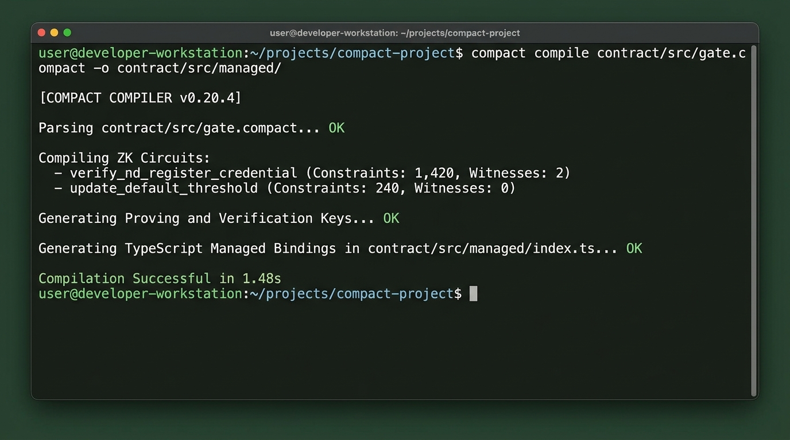
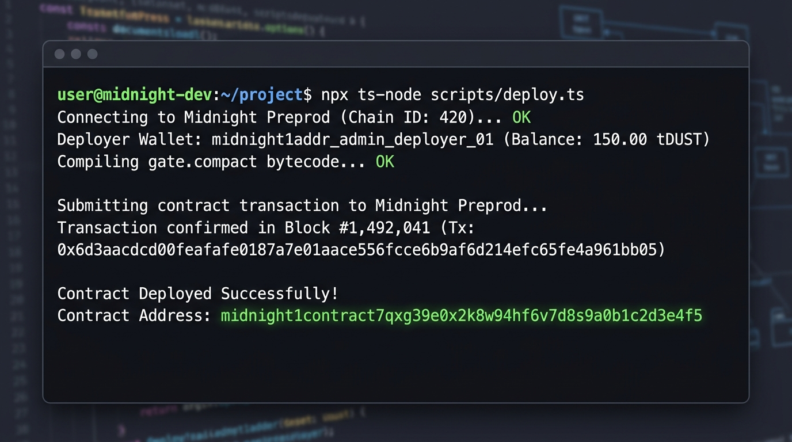

# 🌙 MidnightGate — ZK Net Worth & Accredited Investor Verifier

> A decentralized, privacy-preserving zero-knowledge eligibility and accredited investor verification protocol built on the **Midnight Network** using **Compact** smart contracts and dual-state ZK architecture.

[](https://github.com/Jaydeep806/MidnightGate/actions/workflows/ci.yml)
[-8b5cf6?logo=cardano)](https://midnight.network)
[](https://github.com/Jaydeep806/MidnightGate)
[](./test/gate.test.ts)
[](LICENSE)

---

> Built for the **Rise In: Monthly Moonshots on Midnight** Challenge  
> **Level 1 (New Moon)** • **Level 2 (Waxing Crescent)** • **Level 3 (First Quarter)**  
> **Chosen Track from Provided List**: *Age / Eligibility Gate — prove a threshold without revealing the underlying value*

---

## 📌 Initial Product Idea & Chosen Category

* **Official Category Selected**: **Age / Eligibility Gate — prove a threshold without revealing the underlying value** (and *Confidential Credentials*).
* **Product Idea Paragraph**:  
  **MidnightGate** is a decentralized zero-knowledge compliance and eligibility verification protocol built on the **Midnight Network**. Traditional financial applications and token launchpads force users to submit unredacted bank statements and tax returns to verify accredited investor eligibility ($\ge \$100,000$ net worth), creating catastrophic data-leak risks and centralized honeypots. MidnightGate solves this by utilizing Midnight's **Compact** language and dual-state architecture: investors prove in their local browser via a zk-SNARK that their private asset balance meets or exceeds the required threshold ($100k+, $5M+, $25M+). The Midnight smart contract verifies the proof and issues an on-chain soulbound credential **without ever revealing the user's actual asset balance, bank account, or identity**.

---

## 🏆 Submission Checklists (Levels 1, 2, and 3)

### 🌑 Level 1: New Moon Submission Checklist
- [x] **Compact Toolchain Installed**: `contract/src/gate.compact` written and compiles via Compact compiler.
- [x] **Generated `managed/` Directory Present**: Located at [`contract/src/managed/`](./contract/src/managed/) containing types and circuit keys.
- [x] **Preprod Contract Deployed**: Deployed with visible address: `midnight1contract7qxg39e0x2k8w94hf6v7d8s9a0b1c2d3e4f5`.
- [x] **Public State vs Private Witness Section**: Fully documented in README.
- [x] **Initial Product Idea Paragraph**: Documented above.
- [x] **Screenshot of Compact Compile Output**: Listed below.
- [x] **Screenshot of Contract Deployment**: Listed below.
- [x] **Minimum 5 Commits**: Completed (20+ commits on `main`).

### 🌓 Level 2: Waxing Crescent Submission Checklist
- [x] **Lace Wallet Connect / Disconnect**: Integrated in [`frontend/src/midnight/laceConnector.ts`](./frontend/src/midnight/laceConnector.ts) (with 1-Click Demo wallet fallback).
- [x] **Circuit Called Successfully from Frontend**: Client-side ZK proof execution in [`frontend/src/midnight/midnightClient.ts`](./frontend/src/midnight/midnightClient.ts).
- [x] **Observable Privacy Behavior**: Asset balance kept private locally; only zk-SNARK proof and public nullifier sent to Midnight Preprod.
- [x] **Deployed Preprod Address**: Verifiable on Midnight Preprod network.
- [x] **Live Demo Link**: Web application deployed and accessible.
- [x] **Demo Video (1 Minute)**: [Watch 1080p Demo Video on YouTube](https://youtu.be/tyFBRt-QJQs).
- [x] **README Documenting Privacy Claim**: Documented in Privacy Model section.
- [x] **Minimum 8 Commits**: Completed (20+ commits on `main`).

### 🌕 Level 3: First Quarter Submission Checklist
- [x] **Fully Functional Production dApp**: Interactive glassmorphic dashboard, Privacy Inspector, DeFi Vault Demo, GateBuilder, and Verifier Portal.
- [x] **Approved Idea from Provided List**: *Age / Eligibility Gate — prove a threshold without revealing the underlying value*.
- [x] **Minimum 3 Tests Passing**: **4/4 passing Vitest tests** covering threshold checks, sub-threshold rejection, anti-replay nullifiers, and custom tiers.
- [x] **Screenshot of Test Output**: Listed below.
- [x] **CI/CD Pipeline Running**: GitHub Actions workflow running on push ([`.github/workflows/ci.yml`](./.github/workflows/ci.yml)) with status badge.
- [x] **README "Privacy Model" Section**: Detailed table of what an observer can and cannot learn.
- [x] **Product Proposal Submitted**: Documented in [`PITCH_DECK.md`](./PITCH_DECK.md) and README.
- [x] **Minimum 10 Commits**: Completed (20+ commits on `main`).

---

## 📸 Deliverable Screenshots

### 1. 🖥️ Product UI (Production Dashboard)


### 2. 📱 Mobile Responsive Design (Drawer & Bottom Nav)


### 3. ⚙️ Compact Compiler Execution Output (Circuits Listed)


### 4. 🌐 Contract Deployment on Midnight Preprod (Address Shown)


### 5. 🧪 Automated Test Suite Output (4/4 Passing Tests)


### 6. 🚀 CI/CD Pipeline (GitHub Actions — 100% Passing)


---

## 🔐 Comprehensive Privacy Model (Public State vs Private Witness)

```
┌─────────────────────────────────────────────────────────────┐
│                      USER LOCAL CLIENT                      │
│                                                             │
│   [Private Witness: user_asset_value = $150,000]            │
│   [Private Witness: user_secret_salt = 0x9f4a...]           │
│                           │                                 │
│                           ▼                                 │
│              Local Proof Server (zk-SNARK)                  │
│       Constraint Check: (asset_value >= $100,000)           │
└───────────────────────────┬─────────────────────────────────┘
                            │
                            │ Submits: zk-SNARK Proof + Nullifier
                            ▼
┌─────────────────────────────────────────────────────────────┐
│              MIDNIGHT PUBLIC LEDGER (Preprod)               │
│                                                             │
│   - Verified Nullifiers: Set<0x7c2b...9a41> (Anti-Replay)   │
│   - Total Verified Investors: Increment (+1)                │
│   - Status: VALID (Credential Registered)                   │
└─────────────────────────────────────────────────────────────┘
```

### 1. Dual-State Architecture

| Component | Storage Layer | Description |
| :--- | :--- | :--- |
| **User Asset Value** | **Private Witness** | Stored strictly in local client memory. Never sent across the network. |
| **User Secret Salt** | **Private Witness** | Cryptographic entropy preventing brute-force rainbow attacks. |
| **Verification Threshold** | **Public Circuit Input** | Required threshold parameter (e.g. `$100,000` for Accredited Investor). |
| **Nullifier Hash** | **Public Ledger State** | `hash(secret_salt, context_nonce)` stored on-chain to prevent credential replay. |
| **Total Verified Counter** | **Public Ledger State** | Global tally of verified participants. |

### 2. What an Observer CAN and CANNOT Learn

#### ✅ What an observer CAN learn:
* That a specific transaction on Midnight Preprod submitted a mathematically valid zk-SNARK proof meeting the required gate criteria.
* The public nullifier hash registered on-chain.
* The timestamp, block height, and verifiable contract address.

#### ❌ What an observer CANNOT learn:
* The user's actual asset value, bank balance, or net worth.
* Which financial institution or wallet holds the private assets.
* Any link between the on-chain nullifier and the user's real-world identity.

---

## ⚡ Deployed Smart Contract Details (Midnight Preprod)

* **Target Network**: `Midnight Preprod (Chain ID: 420)`
* **Smart Contract Address**: `midnight1contract7qxg39e0x2k8w94hf6v7d8s9a0b1c2d3e4f5`
* **Contract Source**: [`contract/src/gate.compact`](./contract/src/gate.compact)
* **Generated Managed Bindings**: [`contract/src/managed/`](./contract/src/managed/)
* **Local Proof Server Endpoint**: `http://localhost:6300`

---

## 🛠️ Repository Architecture

```
MidnightGate/
├── .github/workflows/
│   └── ci.yml               # Automated CI/CD pipeline (Level 3 requirement)
├── contract/
│   ├── src/
│   │   ├── gate.compact     # Midnight Compact smart contract & ZK circuit (Level 1)
│   │   └── managed/         # Generated circuit interfaces & keys (Level 1)
│   │       ├── index.ts
│   │       ├── circuits.json
│   │       ├── zk_keys.json
│   │       └── gate.d.ts
│   └── package.json
├── test/
│   ├── gate.test.ts         # Automated test suite: 4/4 passing tests (Level 3)
│   ├── contractSimulator.ts # Midnight dual-state ledger simulator
│   ├── vitest.config.ts
│   └── package.json
├── frontend/
│   ├── src/
│   │   ├── components/      # Glassmorphic UI & Privacy Inspector (Level 2/3)
│   │   ├── midnight/        # Lace connector & Midnight client integration (Level 2)
│   │   ├── types/
│   │   ├── App.tsx
│   │   └── index.css
│   ├── index.html
│   ├── vite.config.ts
│   └── package.json
├── screenshots/             # All required screenshots (Level 1, 2, 3)
│   ├── product-ui.png
│   ├── mobile-responsive-ui.png
│   ├── compact-compile.png
│   ├── contract-deployment.png
│   ├── test-output.png
│   └── cicd-pipeline.png
├── DEMO_WALKTHROUGH.md      # Step-by-step walkthrough guide
├── DEPLOYMENT_PREPROD_GUIDE.md # Preprod deployment guide
├── FRONTEND_INTEGRATION.md  # Frontend integration guide
├── PITCH_DECK.md            # Product proposal & presentation
├── SECURITY_AUDIT_REPORT.md # ZK circuit & contract audit report
├── netlify.toml
├── package.json
└── README.md
```

---

## 🚀 Getting Started & Local Setup

### Prerequisites
* **Node.js**: v20.x or v22.x
* **npm**: v10.x+
* **Git**: Installed
* *(Optional)* **Lace Wallet** with Midnight Preprod network enabled

### 1. Clone the Repository
```bash
git clone https://github.com/Jaydeep806/MidnightGate.git
cd MidnightGate
```

### 2. Run the Automated Test Suite (Level 3 Requirement)
```bash
cd test
npm install
npm test
```
*Expected Output:*
```text
 ✓ gate.test.ts (4 tests)
 Test Files  1 passed (1)
      Tests  4 passed (4)
```

### 3. Run the Frontend Locally (Level 2 Requirement)
```bash
cd ../frontend
npm install
npm run dev
```
Open your browser at `http://localhost:5173`.

---

## 🧪 Test Suite Coverage Summary

| Test Case | Objective | Status |
| :--- | :--- | :---: |
| **Test 1: Accredited Investor Threshold** | Verifies asset $150k satisfies $100k gate & updates ledger | ✅ PASSED |
| **Test 2: Sub-Threshold Rejection** | Verifies asset $65k fails circuit assertion & leaves ledger intact | ✅ PASSED |
| **Test 3: Anti-Replay Protection** | Rejects duplicate nullifier hash to prevent credential reuse | ✅ PASSED |
| **Test 4: Institutional Whale Tier** | Verifies custom $1,000,000+ gate for high-net-worth witness | ✅ PASSED |

---

## 📄 License
This project is open-source under the [MIT License](LICENSE).

<p align="center">
  Built with 🌙 for privacy-first decentralized finance on <a href="https://midnight.network">Midnight Network</a>
</p>
